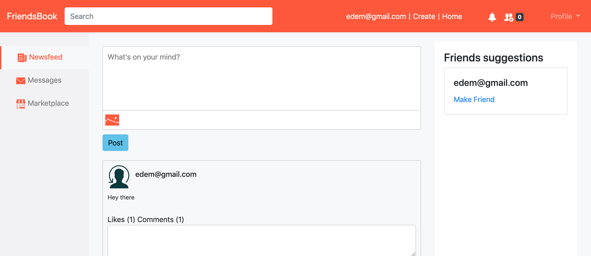

# Facebook-like application with Ruby on Rails

> This is a Facebook-like application built using Ruby, Ruby on Rails and Bootstrap. The application allows for simple features such as posting, making friends, commenting on friends posts and liking of posts.




## Live link

* https://confinini.herokuapp.com/

## Built With ✨

- Ruby Version 2.6.5
- Rails 6.0.1
- Bootstrap

To get a local copy up and running follow these simple example steps.

### Prerequisites
* Ruby version
You will need Ruby Version 2.6.5

* System dependencies
Windows/ Mac
Rails 6.0.1

### Install
Clone project and run
`bundle install --without production`

 Start the rails server
`rails server`

### Testing
You should run
`rspec spec`

## How to contribute and partipate
Fork this repo and submit a PR for review and potential merge to main branch

## How to deploy to heroku
The following steps were taken from this [article](https://devcenter.heroku.com/articles/getting-started-with-rails6)
1. Log in to your heroku account and create an app
2. Make sure you have [heroku cli](https://devcenter.heroku.com/articles/heroku-cli#download-and-install) installed on your machine.
3. Login into your heroku account from the cli ``` heroku login```
4. Add heroku git:remote to your local remote with ```  heroku git:remote -a name-of-app ```
5. Push the master branch of your code to heroku using ``` git push heroku master ```
6. Spin up a dyno to run the web server with ``` heroku ps:scale web=1 ```
7. Run a migration of your db on heroku ``` heroku run rake db:migrate ```

## Authors

👨‍💻 **Edem Agbenyo**

- Github: [@edemagbenyo](https://github.com/edemagbenyo)
- Twitter: [Edem Agbenyo](https://twitter.com/edemAgbenyo)
- LinkedIn: [Edem Agbenyo](https://www.linkedin.com/in/edemagbenyo/)
- Email : [edem.agbenyo@gmail.com](mailto:edem.agbenyo@gmail.com)

👨‍💻 **Christian Salazar**

- Github: [@grifo89](https://github.com/grifo89)
- Twitter: [Christian_sm91](https://twitter.com/Christian_sm91)
- LinkedIn: [Christian Salazar](https://www.linkedin.com/in/christian-salazar-mi%C3%B1o/)


## Known issues or improvement
1. Improve design
2. Allow users to post images, gifs and videos
3. Send confirmation email to user upon registration
